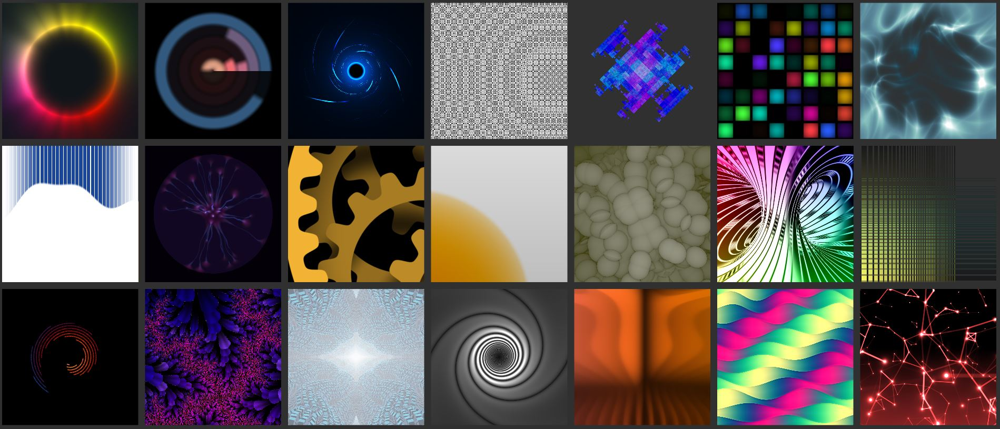
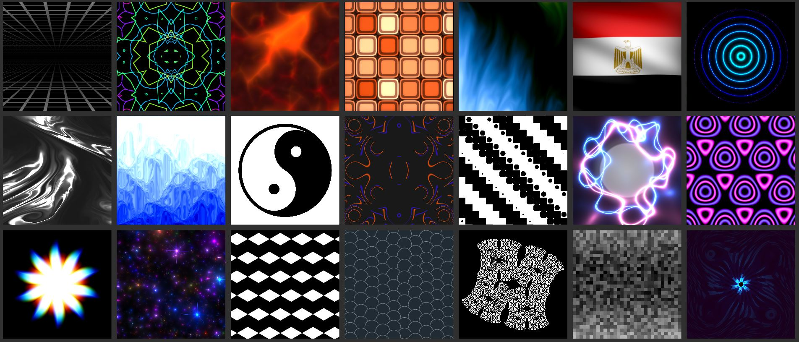
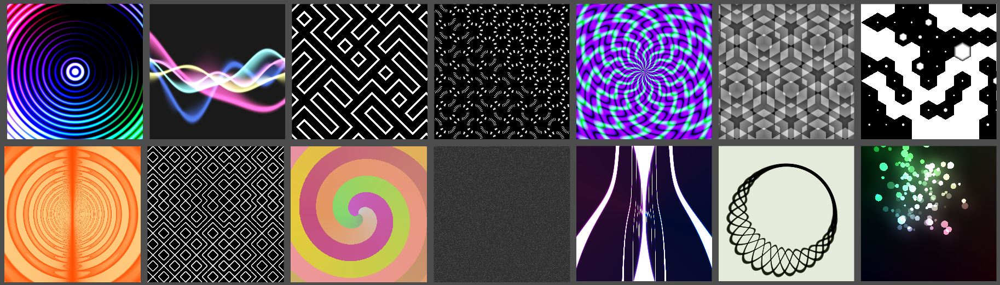
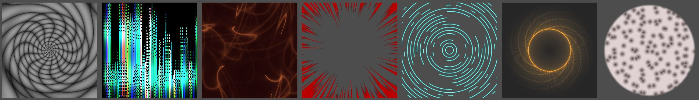

# Shaders from Shader Toy

Converted shaders from ShaderToy to Unity Shading Language

 Unity 2020.1.2f1
 

 - Gears Shader :
 	https://www.shadertoy.com/view/MsGczV

 - Sber Wave :
 	https://www.shadertoy.com/view/Wt3GDS

 - Plasma Globemod :
 	https://www.shadertoy.com/view/MldczX

 - Kaleido Tunnelmod :
 	https://www.shadertoy.com/view/MltcWl

 - Bubbles Circles :
 	https://www.shadertoy.com/view/4dl3zn

 - Vortex2d :
 	https://www.shadertoy.com/view/tltGRs

 - Circle Lines :
 	https://www.shadertoy.com/view/Mts3zM

 - Colored waves :
 	https://www.shadertoy.com/view/tl33Wj

 - FFT-IFS : 
 	https://www.shadertoy.com/view/4lyXWW

 - Grail :
	https://www.shadertoy.com/view/Wl3GWX

 - Circular Calender :
	https://www.shadertoy.com/view/3tKGRD

 - Accidental Fractal :
	https://www.shadertoy.com/view/WtVGzz

 - The ring color mixer :
	https://www.shadertoy.com/view/WtG3RD

 - Toothpick cover :
	https://www.shadertoy.com/view/wtKGzD

 - Dance floor :
	https://www.shadertoy.com/view/lsBXDW

 - James bond rabbit hole :
	https://www.shadertoy.com/view/tlG3WR

 - Colourful Waves :
	https://www.shadertoy.com/view/ttVGDh

 - Simple Prespective Grid :
	https://www.shadertoy.com/view/wlGGRy

 - Phreax Electric Sheep :
	https://www.shadertoy.com/view/wlV3zy

 - Magma Rocks :
	https://www.shadertoy.com/view/4lXfR7

- Circle Pattern :
	https://www.shadertoy.com/view/lss3Df

- Fluid Like :
	https://www.shadertoy.com/view/wty3DG

- Foamy Water :
	https://www.shadertoy.com/view/llcXW7

- Poly Grid :
	https://www.shadertoy.com/view/ttK3W3

- Drawing Circles : 
	https://www.shadertoy.com/view/3tdSRn

- Crumpled Wave :
	https://www.shadertoy.com/view/3ttSzr

- Glowing Marble Shader :
	https://www.shadertoy.com/view/WtdXR8

- Fractal Lines :
	https://www.shadertoy.com/view/wt3SR4
	
- Down Stairs :
	https://www.shadertoy.com/view/WldSzN

- CodeBase Lightning :
	https://www.shadertoy.com/view/wltSWn

- Dizzy Plastic Hazard :
	https://www.shadertoy.com/view/wltXWM

- Colourful Thingy :
	https://www.shadertoy.com/view/WlcSD7

- Hexagonal Shader :
	https://www.shadertoy.com/view/wtdSzX

- Snake Skin :
	https://www.shadertoy.com/view/tt3SDf

- Basic Fractal :
	https://www.shadertoy.com/view/tltSWs

- Noise Wave :
	https://www.shadertoy.com/view/WtyXzR

- Quicky Thing :
	 https://www.shadertoy.com/view/3tKXzw

- Circle Stuff :
	https://www.shadertoy.com/view/WlySzD
	
- FBM Animated Curves :
	https://www.shadertoy.com/view/ttVSDR

- FloorHexTiling :
	https://www.shadertoy.com/view/3ttSW2

- Trippy Visuals :
	https://www.shadertoy.com/view/tlyXzw

- Rotating Circular Waves :
	https://www.shadertoy.com/view/3lGSR3

- Floating Points :
	https://www.shadertoy.com/view/wlGSzc

- Quicky25 :
	https://www.shadertoy.com/view/wlySWc

- Spiral Colored :
	https://www.shadertoy.com/view/3lGXDd

- Sampling Artfacts :
	https://www.shadertoy.com/view/ttVSWd 

- SunShine :
	https://www.shadertoy.com/view/3sXyRr

- Swirly Tunnel :
	https://www.shadertoy.com/view/WslcRr

- PixelatedLines :
	https://www.shadertoy.com/view/wlKSW3

- Smokey Trails :
	https://www.shadertoy.com/view/3lVSWt

- Anime Hit Effect :
	https://www.shadertoy.com/view/wsfcDM

- Rotating cut Lines :
	https://www.shadertoy.com/view/XsfBzj

- Voranoi Gradient :
	https://www.shadertoy.com/view/WdlyRS

- Cell micro :
	https://www.shadertoy.com/view/wdlyzS

- Gold Circle :
	https://www.shadertoy.com/view/tt2GRR

- DNA Shader :
	https://www.shadertoy.com/view/wsXBzr
