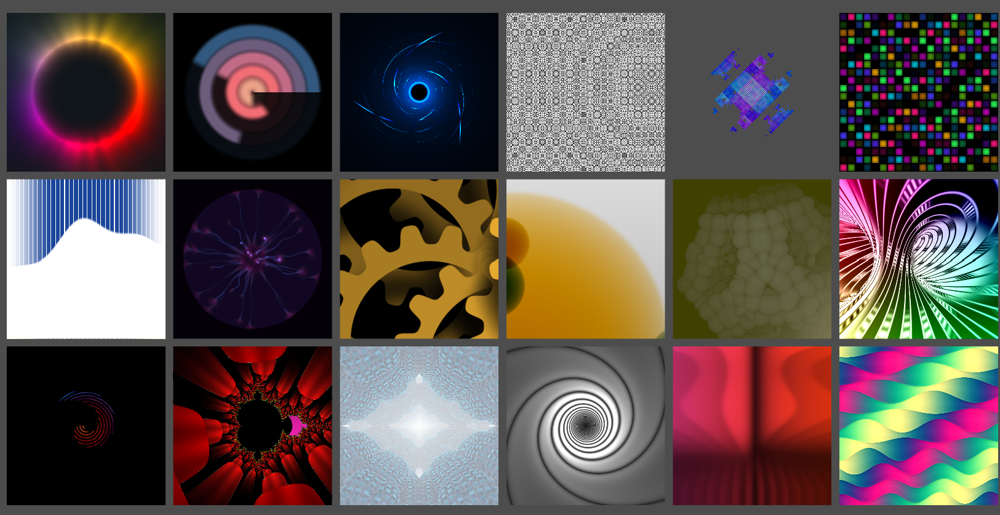

# Shaders from Shader Toy

Converted shaders from ShaderToy to Unity Shading Language

 Unity 2019.3.0f1
 

 - Gears Shader :
 	https://www.shadertoy.com/view/MsGczV

 - Sber Wave :
 	https://www.shadertoy.com/view/Wt3GDS

 - Plasma Globemod :
 	https://www.shadertoy.com/view/MldczX

 - Kaleido Tunnelmod :
 	https://www.shadertoy.com/view/MltcWl

 - Bubbles Circles :
 	https://www.shadertoy.com/view/4dl3zn

 - Vortex2d :
 	https://www.shadertoy.com/view/tltGRs

 - Circle Lines :
 	https://www.shadertoy.com/view/Mts3zM

 - Colored waves :
 	https://www.shadertoy.com/view/tl33Wj

 -  FFT-IFS : 
 	https://www.shadertoy.com/view/4lyXWW

- Grail :
	https://www.shadertoy.com/view/Wl3GWX

- Circular Calender :
	https://www.shadertoy.com/view/3tKGRD

- Accidental Fractal :
	https://www.shadertoy.com/view/WtVGzz

- The ring color mixer :
	https://www.shadertoy.com/view/WtG3RD

- Toothpick cover :
	https://www.shadertoy.com/view/wtKGzD

- Dance floor :
	https://www.shadertoy.com/view/lsBXDW

- James bond rabbit hole :
	https://www.shadertoy.com/view/tlG3WR

- Colourful Waves :
	https://www.shadertoy.com/view/ttVGDh

- Simple Prespective Grid :
	https://www.shadertoy.com/view/wlGGRy

- Phreax Electric Sheep :
	https://www.shadertoy.com/view/wlV3zy

- Magma Rocks :
	https://www.shadertoy.com/view/4lXfR7

- Circle Pattern :
	https://www.shadertoy.com/view/lss3Df
